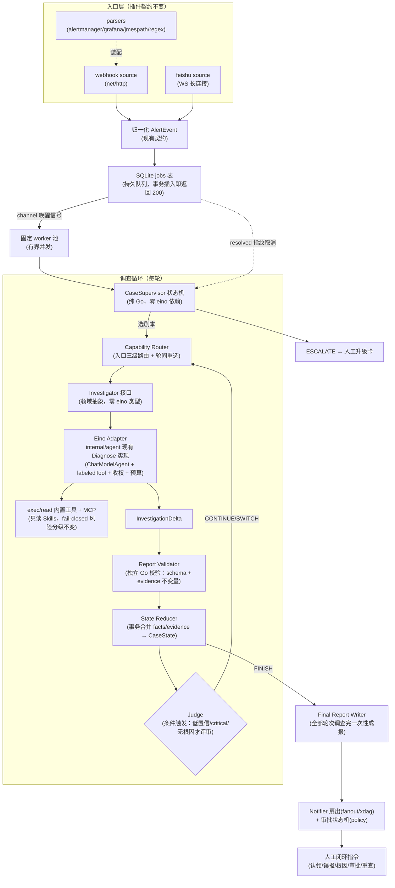

# Case Supervisor 架构升级实施计划

> 状态：待开工（交接文档，供执行 agent 直接使用）
> 日期：2026-09-30 · 基线：main @ 9a081ac · 前置讨论：三轮架构评审（本会话）
> 定位：本文档是 alert-agent 从「单剧本单轮排查」升级到「Case 级多轮调查编排」的唯一执行依据。

---

## 0. 需求提炼（用户原话浓缩）

**目标**：按已确认的「Eino 只做单轮 Tool Loop + 自研 Go CaseSupervisor」架构，实现引用告警的多轮调查编排；**不改变现有插件思想**（Source/Notifier/Parser/Stage 注册制、三层扩展模型、skill.tools 收权全部保持）。

**非目标**：不引入 Redis/MQ/PostgreSQL/对象存储/Langfuse；不用 compose.Graph；不做 Eino checkpoint 恢复；不替换 net/http；不改变单静态二进制部署形态。

---

## 1. 已验证事实（本会话实测，执行前不必重查）

| # | 事实 | 锚点 | 验证方式 |
|---|------|------|----------|
| F1 | 全量测试绿：`go test ./...` 21 包通过（远程主机） | 本会话 job eb0b028f | 远程实测 exit 0 |
| F2 | SQLite 已开 WAL + busy_timeout(5000)，多 worker 条件 UPDATE claim 恰好 1 人成功 | store.go:60 | 探针实测（4 goroutine 并发抢 1 行，winners=1） |
| F3 | **缺陷**：`SaveApproval` 用 `INSERT OR REPLACE`，重跑会把已 executed 审批重置回 pending → 变更可被二次批准执行 | store.go:255 + policy.go:43-60 | 探针实测复现（RED） |
| F4 | **缺陷**：`Decide` 读-判-写非原子，双击/重投并发可双执行变更 | policy.go:69-101 | 代码路径确认（未构造并发复现） |
| F5 | **缺陷**：`tokenModel` 挂在 Runner 单例、无重置点，`agent.max_tokens` 实为进程级累计，越跑越早熔断；Cost.Tokens 跨排查污染 | runner.go:34-35,129-130 + budget.go（无 reset） | 静态确认：单点构造+只读 usage+直读 |
| F6 | **缺陷**：webhook emit 在 `req.Context()` 内同步跑分钟级排查，客户端断连即杀在途排查 | webhook/source.go:152 | 代码路径确认 |
| F7 | eino 类型渗透 7 包（cmd/main.go:19-20、llm.go:9-11、mcp.go:15-16、execenv/tools.go:12-13、execenv/docker.go:8-9、agent/runner.go:12-14、router.go:15-16、budget.go:11-12） | grep cloudwego/eino 共 22 文件 | grep 实测 |
| F8 | `pkg/model`、`pkg/plugin` 零反向依赖 internal，无 import 循环 | pkg/plugin/plugin.go:15 | grep 实测（证无） |
| F9 | store 全参数化 SQL 无注入，但零事务（Begin/Tx 零命中） | store.go 全文 | grep 实测 |
| F10 | **git 索引脏**：暂存区是 v0.6 前旧快照（19 staged + 27 deleted 假象），磁盘=HEAD=最新。直接 commit 会回退约 4000 行 | 本会话 git-status 注入块 | 跨会话记忆 + 状态注入块 |
| F11 | 飞书 WS SDK 每消息一 goroutine（`go c.handleMessageTask`），长回调不阻塞其他消息，但并发排查无上限 | SDK client_message.go:34 | 远程读 SDK 源码 |
| F12 | 远程主机磁盘紧张：清 2G 构建缓存后仅 441M 可用（40G 盘 99% 满） | df 实测 | 远程实测 |

**Eino 能力边界**（外部核验，cloudwego 官方文档 2026-03）：compose CheckPointStore 可插拔、序列化 v0.3.26 后稳定——技术可用但**明确不用**（见 §4 拒绝清单）；仓库锁定 eino v0.9.19（go.mod:6）。

---

## 2. 目标架构



### 组件职责与归属包

| 组件 | 职责 | 落点 | 备注 |
|---|---|---|---|
| 持久队列 | job 落库即 200、崩溃不丢、超时回收 | `internal/store`（jobs 表）+ `internal/dispatch`（新，worker 池） | WAL 已验证支持条件 claim（F2） |
| CaseSupervisor | FINISH/CONTINUE/SWITCH/ESCALATE 四态循环、轮预算、崩溃恢复 | `internal/caseflow`（新） | 纯 Go 状态机，**零 eino import** |
| Capability Router | 入口三级路由复用 + 轮间按证据指向重选剧本 | `internal/agent/router.go` 扩展 | 候选清单内选择 + fail-closed 回落语义保持 |
| Investigator | 领域接口：一次剧本内调查 → Delta | `internal/caseflow`（接口）+ `internal/agent`（实现） | 现有 `Diagnose` 几乎原样适配 |
| Validator / Reducer | Delta 校验（schema+evidence 编号真实存在+不变量）→ 事务合并进 CaseState | `internal/caseflow` | Reducer 是唯一 CaseState 写者 |
| Judge | 独立评审：解释覆盖率/反证/缺口 | `internal/caseflow` | **条件触发**，非每轮（成本纪律） |
| Evidence 存储 | 复用 traces 表，**不新建 Evidence 表** | `internal/store` | Case 视角是 traces 的投影，`-replay` 不分叉 |

### 崩溃恢复模型（轮级重跑，非栈级恢复）

```
轮开始: 持久化本轮输入 CaseState 快照 + attempt 状态 running
轮中:   Eino 调查（分钟级，不 checkpoint）
轮末:   校验 Delta → 事务写 CaseState + attempt=completed
崩溃后: 启动扫描超时 running attempt → 回滚到上一轮已提交快照
        → 同 attempt_id/幂等键重跑（不恢复 Eino 内部栈）
前提:   审批创建幂等（Wave 0.2 修复，否则重跑=变更双执行，F3）
```

---

## 3. 技术选型（已裁决，不再讨论）

| 领域 | 选择 | 理由/锚点 |
|---|---|---|
| HTTP | 现有 net/http | 拒绝 Hertz：纯迁移成本 |
| 异步调度 | SQLite 持久队列 + 固定 worker 池，channel 仅作唤醒信号 | claim 机制实测可行（F2）；进程重启不丢任务 |
| 业务编排 | 普通 Go 状态机 | Supervisor 拥有状态与流程 |
| Agent Runtime | Eino ADK ChatModelAgent（v0.9.19，锁定） | 仅单轮 tool loop；升级走独立 PR |
| 持久化 | SQLite（modernc.org/sqlite，无 CGO） | 单文件零运维；PG 留迁移缝（触发条件：多实例/数据量超限） |
| 检查点 | 每轮末持久化 CaseState | 拒绝 Eino checkpoint/Redis：轮级重跑更简单且符合 DESIGN §0 |
| 指标/日志/回放 | 现有 /metrics + slog + `-replay` | 全部复用 |
| 报告校验 | 独立 Go Validator | 现有 `rep.Validate()` 扩展 |
| FORK | **v1 不实现**（枚举值留位） | 成本乘法；触发条件：出现真实并行假设需求 |
| Judge | 条件触发 | 全量评审 token 成本 ≥2x |

**明确不采用**（违反即打回）：compose.Graph 做任何调查管道（DESIGN §0 明文）；Eino checkpoint 恢复跨轮状态；为 Eino 引入 Redis；替换 net/http；引入 MQ/PostgreSQL/对象存储/Langfuse。

---

## 4. 硬约束（架构红线）

1. **插件契约冻结**：`pkg/plugin`（Source/Notifier/Stage 注册制）、`pkg/model.AlertEvent`、三层扩展模型、`skill.tools` 收权语义——签名与行为不变。新调查能力全部在契约层内部实现。
2. **Eino 类型边界**：`internal/caseflow`、`internal/store`、`internal/webhook`、`internal/feishu`、`internal/pipeline`、`internal/policy`、`cmd/` **禁止 import `cloudwego/eino`**。eino import 只允许出现在 `internal/agent`、`internal/agent/eino`、`internal/llm`、`internal/mcp`、`internal/execenv`（后三者向 Investigator 抽象收敛后逐步清除）。Wave 3 落地 import 守卫测试固化此边界。
3. **安全不变量**（继承 v0.6，不得削弱）：
   - exec 风险分级 fail-closed：词对齐前缀未命中一律 mutating；排查阶段只读环境（Acquire），审批后 AcquireFull；
   - read 工具限定剧本目录 + Clean 后二次前缀校验；
   - mutating 动作必须携带与技能文档逐字一致的 argv，执行前子命令存在性探测；
   - **审批幂等新不变量**：`executed/rejected/approved` 状态的审批**永不可回退到 pending**；executor 对每个 (event_id, action_id) 至多执行一次。
4. **取消纪律**：resolved 事件按指纹取消在途排查（inflight）——升级后同时取消**队列中待处理 job 与运行中 Case**；沙箱清理用独立 ctx 不随排查取消。
5. **成本纪律**：预算 per-Case（token）+ per-Round（iterations），修 F5 后语义为「单次调查」；去重前置保留；Judge 条件触发。
6. **行为等价纪律**：Wave 0/2 中搬运现有闭包（handleEvent、审批执行器）到独立函数时**逐字等价搬运**，行为变更放独立 commit。
7. **部署形态**：单静态二进制（CGO_ENABLED=0），配置仍为单 YAML + `${ENV}` 展开。

---

## 5. 实施波次

> 执行环境纪律（AGENTS.md）：构建/测试/git 全部在远程主机执行（`ssh <remote-host> "cd <repo-path> && <cmd>"`）；改本地文件后 `mutagen sync flush alert-agent`；禁止本地 git 写操作。**磁盘仅 441M 可用（F12）**：开工前先 `ssh <remote-host> "df -h /"`，低于 2G 先清 `go clean -cache` 或提醒用户清理 `<other-project-dir>`（8.9G，需用户确认）。

### Wave 0 — 前置修复（阻断项，不修不许动架构）

- [ ] **0.1 清理脏 git 索引**。现状见 F10。处理：`ssh <remote-host> "cd <repo-path> && git reset"`（仅重置索引，不碰工作树）——`git reset` 属破坏性命令类别，**执行前必须向用户确认一次**。验证：`git status` 后 staged 清空、工作树文件与 HEAD 内容一致（抽查 `git diff` 为空、untracked 保持）。
- [ ] **0.2 审批幂等 + 双击竞态修复（RED→GREEN）**。
  - 先写失败测试（放 `internal/policy/policy_test.go` 或 store_test.go）：
    - T1 幂等：预置 `executed` 审批 → 调 `CreateApprovals` 重建 → 断言状态仍 executed、decided_by/result 未被清空（即 F3 探针场景的固化）；
    - T2 并发：两 goroutine 同时 `Decide(approve=true)` 同一审批，executor（计数 fake）断言**恰好执行 1 次**，另一方收到「已处理过」错误；
    - T3 乱序：先 reject 后并发 approve，断言终态 rejected 且 executor 0 次。
  - 修法（根因在写入侧）：`SaveApproval` 拆两个入口——`CreateApprovals` 路径改 `INSERT ... ON CONFLICT(event_id,action_id) DO NOTHING`；`Decide` 状态推进改条件 UPDATE `SET status=? WHERE event_id=? AND action_id=? AND status='pending'`，`RowsAffected==1` 才继续执行 executor。注意 Decide 里 executor 执行后的二次落库（executed/failed）不受 pending 条件约束，用直接写。
  - 验证：`go test ./internal/policy/ ./internal/store/ -count=1` 全绿 + 全量回归。
- [ ] **0.3 token 预算 per-调查修复（RED→GREEN）**。
  - 先写失败测试（budget_test.go）：同一 Runner 连续两次 `Diagnose`（fake model 各报 usage 500），断言第二次报告 `Cost.TokensIn==500`（现状会累计到 1000 → RED）；再断言 `maxTokens=800` 时第二次调查独立生效（第一次耗 600 后第二次仍可跑 600 而非只剩 200）。
  - 修法：计量下沉为 per-`Diagnose` 实例——`Diagnose` 内构造 `newTokenModel(reasoner, maxTokens)` 包装后传给引擎，Runner 不再持有 meter（或 meter 每次 reset，但 per-call 实例更干净，无共享可变状态）。
  - 验证：`go test ./internal/agent/ -count=1` + 全量回归。
- [ ] Wave 0 收口：`ssh <remote-host> "cd <repo-path> && go build ./... && go test ./... -count=1"` 全绿后，三个修复各自独立 commit（fix: 前缀）。

### Wave 1 — store 基建：事务 + jobs 表 + claim/回收

- [ ] 1.1 store 引入事务支持：`Store.WithTx(ctx, fn func(*Tx) error) error`（database/sql 原生 Begin/Commit/Rollback；SQLite 单写者，写事务内不做任何外部 IO——LLM/通知调用严禁进事务）。现有单条写 API 保持不动。
- [ ] 1.2 jobs 表（schema 见 §6）+ 三个 API（全部走 store 层，worker 逻辑在 Wave 2 的 dispatch 包）：
  - `EnqueueJob(ctx, kind, payload, dedupKey) `：事务插入，`dedupKey` 唯一索引实现入队幂等（webhook 重复投递天然去重）；
  - `ClaimNextJob(ctx, workerID, kinds []string)`：**单条条件 UPDATE**（`UPDATE jobs SET status='running', claimed_by=?, claimed_at=? WHERE id=(SELECT id FROM jobs WHERE status='pending' AND available_at<=now AND kind IN (...) ORDER BY id LIMIT 1) AND status='pending'`，RowsAffected==0 返回空）——机制已被探针验证（F2）；
  - `ReclaimStaleJobs(ctx, olderThan)`：同样条件 UPDATE 抢占超时 running（attempt+1，超 max_attempts 置 failed）。
- [ ] 1.3 测试（固化探针为正式测试）：并发 8 worker claim 同一批 job 断言无重复领取；dedupKey 重复入队仅 1 行；stale 回收后原 worker 的完成写入被拒（状态已非 running）。
- 验证：`go test ./internal/store/ -count=1`；本波不改任何调用方，全量测试必须原样绿。

### Wave 2 — 入口异步化（修 F6）

- [ ] 2.1 新建 `internal/dispatch`：固定 worker 池（默认 `min(4, runtime.NumCPU())`，配置 `dispatch.workers`），channel 仅作唤醒信号（容量 1，非阻塞发），真源是 SQLite pending job 轮询（退避 1s~5s）+ 唤醒立即拉。
- [ ] 2.2 webhook source 改造：`emit` 改为 `EnqueueJob`（payload=完整 AlertEvent JSON）；**ctx 与 req.Context() 彻底解耦**；队列深度超 `dispatch.max_depth`（默认 1000）返回 503（不静默丢——Alertmanager 会按自身节奏重发）。
- [ ] 2.3 feishu source 改造：`onMessage` 中的长路径（handleFollowup/recheck、investigateQuoted → emit）同样入队；闭环指令中**纯 DB 操作**（claim/false-positive/root-confirmed 落库）可留同步，approve（触发执行器）入队走 job（审批执行也变异步可重试，幂等由 Wave 0.2 保证）。
- [ ] 2.4 worker 内执行现有 `handleEvent`（先逐字搬运 main.go 的 handleEvent 闭包到 `internal/app/handle.go`，行为等价；resolved 取消路径保留：worker 取 job 后先查 inflight/事件状态再决定跑）。
- [ ] 2.5 **端到端集成测试（不 mock 中间层）**：httptest 起 webhook → 真实 SQLite（t.TempDir）→ 真实 dispatch 池 → fake Investigator（仅这一层 fake，eino 不进测试）→ 断言：事件落库 + job done + 503 路径 + **handler 返回后立刻取消 req ctx，调查仍完成**（F6 的回归固化）。
- 验证：`go test ./internal/dispatch/ ./internal/webhook/ -count=1` + 全量回归。

### Wave 3 — Investigator 抽象 + Eino 类型收敛（工作量主体）

- [ ] 3.1 `internal/caseflow` 定义领域接口（**零 eino 类型**，签名见 §6）：`Investigator`、`InvestigationInput/Delta`、`Router`（`SelectSkill(ctx, evt, facts) *skills.Skill`）、`Validator`、`Clock`（可注入时间，测试用）。
- [ ] 3.2 `internal/agent` 提供适配器：现有 `Runner.Diagnose` 包装成 `Investigator` 实现（Evidence 结构做一层 caseflow 视角映射）；`New(reasoner, tools, ...)` 的 eino 参数类型收进 agent 包内，对 caseflow 只暴露构造工厂 `agent.NewInvestigator(cfg AgentConfig) (caseflow.Investigator, error)`。
- [ ] 3.3 清理渗透点（F7 清单）：cmd/main.go、llm、mcp、execenv 的 eino import 内部化——llm 返回自有 `LLM` 接口（Generate 签名去 schema.Message，或包一层自有 Message）；execenv 工具构造在 agent 包内完成。**目标：import 守卫测试可开**。
- [ ] 3.4 import 守卫测试（`internal/imports_test.go`）：遍历 `cmd/`、`internal/{caseflow,store,webhook,feishu,pipeline,policy,notifier,dispatch,config,metrics,eval,skills,inflight,fanout}` 断言零 `cloudwego/eino` import；白名单显式列 `internal/agent`、`internal/agent/eino`、`internal/llm`、`internal/mcp`、`internal/execenv`。
- [ ] 3.5 行为等价验证：eval 路由档 `go run ./cmd/alert-agent -config config.smoke.yaml -eval` 结果与改造前一致（有评测集则用，无则跳过并记录）。
- 验证：`go test ./... -count=1` + `go vet ./...`；守卫测试从 RED（当前 cmd 等 5 处必红）到 GREEN。

### Wave 4 — CaseSupervisor + CaseState + 轮级重跑

- [ ] 4.1 store 增表（schema §6）：`cases`、`case_rounds`；`-replay` 兼容（traces 不动，Case 视图叠加查询）。
- [ ] 4.2 Supervisor 主循环（`internal/caseflow/supervisor.go`）：
  - 每轮：Capability Router 选剧本（首轮=现有三级路由；后续轮=router 小模型基于「当前 facts + 未解 open items」在候选清单重选，fail-closed 回落 CONTINUE 原剧本/ESCALATE）→ Investigator → Validator → Reducer 事务合并 → 判定下一状态；
  - 状态机：`FINISH | CONTINUE | SWITCH | ESCALATE`（FORK 留枚举位不实现）；判定规则 v1 从简：报告 needs_human=true → ESCALATE；有新 open item 且轮数<max_rounds（默认 3）→ CONTINUE/SWITCH；否则 FINISH；
  - Judge 条件触发：`max(root_causes.confidence) < 0.6 || severity==critical || len(root_causes)==0` 时跑一轮独立评审（复用 router 小模型），产出「缺口清单」进 open items。
- [ ] 4.3 崩溃恢复：启动时 `ReclaimStaleJobs` + 扫描超时 running attempt → 回滚 CaseState 到上一轮快照 → 以同 attempt_id 重新入队。**依赖 Wave 0.2 的审批幂等**（重跑不重复建审批）。
- [ ] 4.4 预算升级：Case 级 max_tokens 累计口径（各轮 InvestigationDelta 的 Cost 之和），轮级 max_iterations 沿用；超 Case 预算 → 熔断产出部分结论 + ESCALATE。
- [ ] 4.5 resolved 取消贯穿：inflight 指纹取消扩展到「取消队列中该 Case 的后续轮 job + 运行中轮 ctx」；被取消 Case 终态 cancelled，不发失败卡（现有静默纪律保持）。
- [ ] 4.6 测试：状态机表驱动单测（状态×输入→转移）；崩溃恢复集成测试（真 SQLite：插入 running attempt + 旧快照 → 触发恢复 → 断言 CaseState 回滚 + 重跑恰一次 + 审批不重复）；并发双 Case 互不串扰。
- 验证：`go test ./internal/caseflow/ ./internal/store/ -count=1` + 全量回归 + 一次 smoke 实弹（config.smoke.yaml + 引用卡片或 curl webhook）。

### Wave 5 — 收尾对账

- [ ] 5.1 文档同步：DESIGN §2.2 表格修正（三解析器已实现，F 前 Scout 发现的漂移）、§6 目录布局更新（新增 caseflow/dispatch/app）、新增 §11 Case Supervisor 章节与 §5 关联（闭环指令映射到 Case 操作）；README 机制段更新。
- [ ] 5.2 指标补充：`alert_agent_queue_depth`（gauge）、`alert_agent_case_rounds_total`（counter, outcome）、`alert_agent_case_state`（gauge, state）；接入现有 metrics.Registry。
- [ ] 5.3 config 增量：`dispatch: { workers, max_depth, stale_after }`、`caseflow: { max_rounds, judge: {min_confidence} , max_tokens }`，config.example.yaml 同步注释（`agent.max_tokens` 注释改为「单次调查」语义已由 0.3 落实）。
- [ ] 5.4 终验收：全量测试 + build + smoke 实弹一次 + `grep -r "cloudwego/eino" cmd internal --include="*.go" | grep -v "_test" ` 输出仅白名单包。

---

## 6. 契约与 Schema 草案（实现时按此落，偏差需回本档记录）

```go
// internal/caseflow/investigator.go —— 零 eino import
type InvestigationInput struct {
    CaseID   string
    Round    int
    Skill    *skills.Skill        // 已收权剧本
    Event    *model.AlertEvent
    Facts    []Fact               // Reducer 累积事实
    Extra    string               // incident/追问等附加上下文
}
type Fact struct { ID, Kind, Statement string; EvidenceIDs []string; Round int }

type InvestigationDelta struct {
    Report   *model.DiagnosisReport
    Evidence []EvidenceRef          // {ID, Tool, Round}——traces 行引用，不复制内容
    Cost     model.ReportCost
}

type Investigator interface {
    Investigate(ctx context.Context, in InvestigationInput) (InvestigationDelta, error)
}
```

```sql
-- Wave 1
CREATE TABLE IF NOT EXISTS jobs (
  id INTEGER PRIMARY KEY AUTOINCREMENT,
  kind TEXT NOT NULL,                 -- webhook_event|feishu_msg|approval_exec|case_round
  dedup_key TEXT UNIQUE,              -- 入队幂等（fingerprint/msg_id/attempt_id）
  payload TEXT NOT NULL,
  status TEXT NOT NULL DEFAULT 'pending',   -- pending|running|done|failed
  attempts INTEGER NOT NULL DEFAULT 0,
  available_at TIMESTAMP NOT NULL,    -- 退避重试
  claimed_by TEXT, claimed_at TIMESTAMP,
  created_at TIMESTAMP NOT NULL
);
CREATE INDEX IF NOT EXISTS idx_jobs_ready ON jobs(status, available_at);

-- Wave 4
CREATE TABLE IF NOT EXISTS cases (
  id TEXT PRIMARY KEY,                -- 事件 ID 即 Case ID（v1 单事件单 Case）
  fingerprint TEXT NOT NULL,
  state TEXT NOT NULL,                -- investigating|finished|escalated|cancelled
  current_skill TEXT, round INTEGER NOT NULL DEFAULT 0,
  facts TEXT,                         -- JSON []Fact
  tokens_used INTEGER NOT NULL DEFAULT 0,
  created_at TIMESTAMP NOT NULL, updated_at TIMESTAMP NOT NULL
);
CREATE TABLE IF NOT EXISTS case_rounds (
  case_id TEXT NOT NULL, round INTEGER NOT NULL, attempt_id TEXT NOT NULL,
  skill TEXT NOT NULL, status TEXT NOT NULL,     -- running|completed|failed|cancelled
  input_state TEXT,                               -- 本轮输入快照（恢复点）
  delta TEXT,                                     -- 校验通过的 Delta JSON
  PRIMARY KEY (case_id, round, attempt_id)
);
```

---

## 7. 反证与待验证假设（瑶光条款）

| 假设 | 状态 | 反证义务 |
|---|---|---|
| WAL 下条件 UPDATE claim 并发安全 | **已验证**（探针 4 并发恰 1 胜） | Wave 1.3 固化为 8 worker 正式测试 |
| INSERT OR REPLACE 破坏审批幂等 | **已验证 RED**（探针复现） | Wave 0.2 修复后探针场景转 GREEN |
| 双击竞态真实可触发 | 静态确认未并发复现 | Wave 0.2 T2 用真 goroutine 并发复现后修 |
| webhook 断连杀排查 | 代码路径确认未实测断连 | Wave 2.5 集成测试：handler 返回即 cancel req ctx |
| token 累计缺陷 | 静态确认（单点构造+无 reset 链完整） | Wave 0.3 RED 测试先行复现 |
| 轮级重跑不丢审批状态 | 推理（依赖 0.2） | Wave 4.6 崩溃恢复测试显式断言 |
| Supervisor 每轮 eino agent 冷启动无状态残留 | 推理（现状每次 Diagnose 新建 agent 实例，eino/runner.go Run） | Wave 4.6 双轮调查断言 evidence 编号 T1 重新起算、无跨轮泄漏 |
| capability 轮间重选能收敛（不无限 SWITCH） | **未验证假设** | Wave 4.2 强制 max_rounds 硬顶 + SWITCH 连续≥2 次强制 ESCALATE；评测集回归 |

## 8. 交接备注（给执行 agent）

- 执行环境见 AGENTS.md：一切 build/test/git 在远程主机（见 AGENTS.md）；本机只改文件 + `mutagen sync flush alert-agent`；`.conflict` 文件停下报告用户。
- 每个波次收口跑全量：`ssh <remote-host> "cd <repo-path> && go build ./... && go test ./... -count=1"`；提交按逻辑单元拆分，message 前缀 fix/feat/refactor，**永不 amend**。
- Wave 0.1 的 `git reset` 与任何磁盘清理涉及他人目录（`<other-project-dir>`）时，先向用户确认再动手。
- 远程主机磁盘紧张是持续风险（F12，441M 可用时实测）：每次全量测试前瞄一眼 `df -h /`，低于 2G 先 `go clean -cache`。
- 本文档与 DESIGN.md 冲突时，以本文档为准（Wave 5 会把差异写回 DESIGN）。
